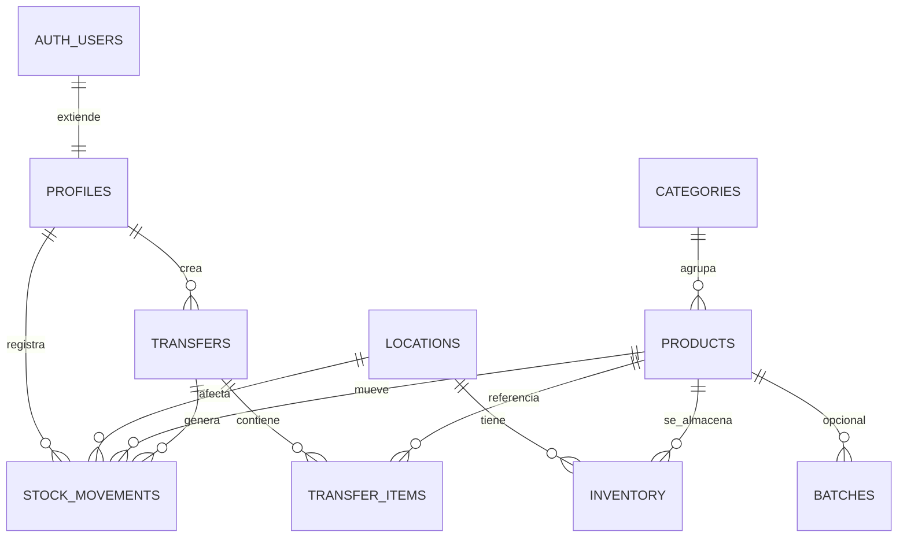

# MODELO DE DATOS (DRAFT) — Inventario Kilker

> ⚠️ **BORRADOR.** Basado en supuestos razonables para un inventario de pinturas
> multi-sucursal. **Debe validarse contra las especificaciones** antes de implementar.
> Motor: **PostgreSQL (Supabase)**. Esquema definido con **Drizzle** (`server/db/schema.ts`).
> Idioma: español. Última actualización: 2026-06-19.

---

## Supuestos (a confirmar con specs)

- El stock se controla **por sucursal** (no un único almacén global).
- Un "producto" es una **variante vendible concreta** (p. ej. "Esmalte X blanco brillante
  1 L" = un SKU). Si la empresa maneja color/tamaño como combinaciones, se evaluará
  separar `products` de `product_variants`.
- Hay **movimientos** que registran toda variación de stock (auditable).
- **Transferencias entre sucursales**: asumidas como necesarias (a confirmar).
- **Lotes/caducidad y códigos de barras**: opcionales, dependen del alcance.

## Convenciones de esquema

- **Autenticación:** la gestiona **Supabase Auth** en la tabla `auth.users` (id `uuid`).
  La app usa una tabla **`profiles`** (1:1 con `auth.users`) para datos propios + rol.
- **IDs de tablas de negocio:** `bigint generated always as identity` (autoincremental).
- **Enums:** se usan **enums de Postgres** vía `pgEnum` de Drizzle (p. ej. tipo de
  movimiento, estado de transferencia).
- **Todo el esquema** se crea/modifica con **Drizzle + drizzle-kit**, nunca a mano.

---

## Entidades principales

### `profiles` (perfil de usuario)
Extiende a los usuarios de Supabase Auth con datos de la app.
- `id` (uuid, FK → `auth.users.id`), `full_name`, `role` (admin | bodega | ventas),
  `is_active`, timestamps.

### `locations` (sucursales)
- `id`, `name`, `code`, `address`, `is_active`, timestamps.

### `suppliers` (proveedores)
- `id`, `name`, `contact`, `phone`, `email`, `is_active`, timestamps.

### `categories` (categorías / líneas de producto)
- `id`, `name`, `parent_id` (opcional, jerarquía), timestamps.

### `products`
Catálogo. Atributos de pintura marcados en **negrita** (validar con specs).
- `id`, `sku`, `name`, `brand`, `category_id` (→ `categories`)
- **`color`**, **`color_code`**, **`base`**, **`finish`** (acabado), **`volume`**/unidad
- `barcode` (opcional), `unit` (L, gal, unidad…)
- `price`, `cost` (opcionales), `is_active`, timestamps.

### `inventory` (stock por sucursal)
Existencias actuales = producto × sucursal.
- `id`, `product_id` (→ `products`), `location_id` (→ `locations`)
- `quantity`, `min_quantity` (alerta de mínimo, opcional)
- **único** (`product_id`, `location_id`), timestamps.

### `stock_movements` (kardex / auditoría)
Todo cambio de stock queda registrado aquí.
- `id`, `product_id`, `location_id`, `user_id` (→ `profiles`/`auth.users`)
- `type` — **pgEnum** (`entrada` | `salida` | `ajuste` | `transferencia`)
- `quantity`, `reason`, `reference`
- `batch_id` (opcional → `batches`), `transfer_id` (opcional → `transfers`)
- `created_at`.

### `transfers` (transferencias entre sucursales)
- `id`, `from_location_id`, `to_location_id`, `user_id`
- `status` — **pgEnum** (`pendiente` | `en_transito` | `recibida` | `cancelada`)
- timestamps.

### `transfer_items`
- `id`, `transfer_id` (→ `transfers`), `product_id`, `quantity`.

---

## Entidades opcionales (según alcance)

### `batches` (lotes / caducidad)
- `id`, `product_id`, `batch_code`, `expiry_date`, `quantity`, timestamps.

### Referencias de compra/venta
- Si se requiere: `purchase_orders` / `sales_orders` con sus `*_items`. **Fuera de
  alcance hasta confirmar specs** (podría integrarse con un POS/facturación externo).

---

## Relaciones (resumen)

```
auth.users 1───1 profiles
profiles 1───* stock_movements
profiles 1───* transfers

locations 1───* inventory
locations 1───* stock_movements
locations 1───* transfers (from / to)

products 1───* inventory
products 1───* stock_movements
products *───1 categories
products *───* suppliers        (pivote, opcional)
products 1───* batches          (opcional)

transfers 1───* transfer_items *───1 products
transfers 1───* stock_movements
```



---

## Notas de implementación

- El esquema se define en **`server/db/schema.ts`** (Drizzle) y se aplica con
  `drizzle-kit generate` + `drizzle-kit migrate` (ver [`../CLAUDE.md`](../CLAUDE.md)).
- Las operaciones que afectan stock (entradas, salidas, transferencias) deben ser
  **transaccionales** (`db.transaction(...)` de Drizzle), ejecutadas en las rutas
  `server/api/`, para mantener consistencia con múltiples sucursales/usuarios concurrentes.
- `inventory.quantity` es un **saldo derivado**: se actualiza junto con cada
  `stock_movements` dentro de la misma transacción; `stock_movements` es la **fuente de
  verdad auditable**.
- **Seguridad:** las escrituras pasan por `server/api/` (con verificación de rol). Si se
  permiten lecturas directas desde el cliente vía Supabase, protegerlas con **RLS**.
