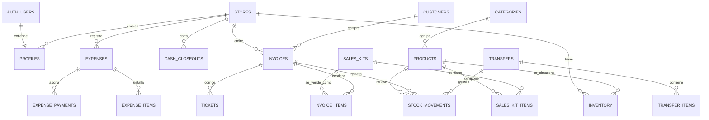

# MODELO DE DATOS — Inventario Kilker

> **Fuente de verdad: [`kilker-inventario/server/db/schema.ts`](../kilker-inventario/server/db/schema.ts).**
> Este documento es un **resumen legible** de ese archivo; si discrepan, manda el código.
> Motor: **PostgreSQL (Supabase)**. Esquema definido y migrado **solo** con Drizzle +
> `drizzle-kit` (migraciones en `kilker-inventario/server/db/migrations/`, `0000`–`0024`).
> Idioma: español. Última actualización: 2026-08-10.

---

## Convenciones de esquema

- **Autenticación:** la gestiona **Supabase Auth** (`auth.users`, id `uuid`). La app usa
  **`profiles`** (1:1 con `auth.users`, FK con `ON DELETE CASCADE` añadida en la migración
  manual `0001`) para datos propios + rol + sucursal.
- **IDs de negocio:** `bigint generated always as identity`.
- **Enums de Postgres** vía `pgEnum`.
- **Dinero y cantidades:** `numeric(14,2)` para importes, `numeric(14,3)` para cantidades.
  ⚠️ Los `numeric` llegan a la UI como **string** (usar `Number()`); ver
  `app/types/inventario.ts`.
- **RLS habilitado en todas las tablas, sin policies** → nadie accede desde el cliente; todo
  pasa por `server/api/` (que usa la conexión de servicio y bypassa RLS).
- **Bajas suaves:** productos, sucursales, clientes y empleados se desactivan
  (`is_active`), no se borran.

## Enums

| Enum | Valores |
|------|---------|
| `user_role` | `admin`, `empleado` |
| `movement_type` | `venta`, `entrada`, `ajuste`, `transferencia_salida`, `transferencia_entrada`, `anulacion` |
| `invoice_status` | `emitida`, `anulada` |
| `transfer_status` | `pendiente`, `en_transito`, `recibida`, `cancelada` |
| `ticket_status` | `abierto`, `aprobado`, `rechazado` |
| `ticket_target` | `factura`, `movimiento` (v1 solo usa `factura`) |
| `product_unit` | `litro`, `galon`, `cubeta`, `pieza`, `cuarto`, `tambo` |
| `payment_method` | `efectivo`, `tarjeta`, `transferencia` |
| `sale_channel` | `mostrador`, `en_linea` |
| `expense_type` | `Fijo`, `Operativo` |
| `discount_type` | `porcentaje`, `combo` (declarado; el descuento vigente es por factura) |

---

## Tablas (19)

### Base

| Tabla | Contenido |
|-------|-----------|
| `stores` | Sucursales. `name`, `code` (**único**, se usa en folios y **no se edita**), `address`, `is_active`. |
| `profiles` | Perfil de app 1:1 con `auth.users`. `full_name`, `role`, `store_id` (null = admin global), `is_active` (desactivar = dar de baja el acceso). |
| `categories` | Categorías/líneas con jerarquía opcional (`parent_id` → sí misma). |
| `products` | Catálogo. `sku` (único), `name`, `category_id`, `color` (texto libre), `unit`, `price`, `cost` (**costo estándar de la marca**), `barcode`, `min_quantity`, `max_quantity`, `is_active`. |
| `inventory` | Saldo materializado por **producto × sucursal**. Único `(product_id, store_id)` + `CHECK quantity >= 0`. |

### Movimientos (kardex)

| Tabla | Contenido |
|-------|-----------|
| `stock_movements` | **Libro append-only**: un trigger (migración `0001`) rechaza UPDATE/DELETE. `type`, `quantity` **con signo** (+ entra / − sale), `unit_value`, `total_value`, `invoice_id`, `transfer_id`, `reverses_movement_id` (liga la reversa al original), `supplier_invoice_number`/`_date` (factura del proveedor en entradas) y `"Folio"` (folio interno de entrada, único por tienda). |
| `entry_folio_counters` | Contador `last_seq` por tienda para el folio de entradas (`<CODE>-E-0001`). Upsert atómico. |

### Ventas

| Tabla | Contenido |
|-------|-----------|
| `invoices` | Comprobante interno (sin CFDI/SAT). `folio` (único por tienda, `<CODE>-0001`), `store_id`, `customer_id`, `created_by`, `status`, `payment_method`, `channel`, `discount_pct`/`discount_amount`, `total_amount`, `issued_at` (admite fecha retroactiva) y `voided_at/by/reason`. |
| `invoice_items` | Líneas. `quantity`, `unit_price` (**snapshot** al vender), `line_total`. `discount_type`/`discount_value`/`tax_rate` existen pero hoy no se llenan (el IVA se calcula en la app, 16% informativo). **Venta por kit:** `kit_id` + `kit_sku`/`kit_name` (**snapshot**) + `kit_quantity` marcan de qué kit salió la línea; null = producto suelto. |
| `customers` | Clientes. `name`, `rfc` (**único**), `address`, `email`, `phone`, `is_active`. |

### Kits de venta

| Tabla | Contenido |
|-------|-----------|
| `sales_kits` | Cabecera del kit. `sku` (**único**), `name`, `is_active`. **No tiene inventario propio.** |
| `sales_kit_items` | Productos que lo componen. `quantity` y `unit_price` **nullable**: null = la línea hereda `products.price`. Único `(kit_id, product_id)`; borrado en cascada con el kit. |

### Transferencias entre sucursales

| Tabla | Contenido |
|-------|-----------|
| `transfers` | `from_store_id`, `to_store_id`, `status`, `created_by`, `issued_at`, `received_at`/`received_by`, `canceled_at`/`canceled_by`/`cancel_reason`. |
| `transfer_items` | `product_id`, `quantity`. Generan salida en origen al crear y entrada en destino al recibir. |

### Correcciones, caja y gastos

| Tabla | Contenido |
|-------|-----------|
| `tickets` | Solicitudes de corrección: `raised_by`, `store_id`, `target`, `invoice_id`/`movement_id`, `reason`, `status`, `resolved_by`/`resolution_note`. |
| `cash_closeouts` | Corte por turno: ventana (`period_from` → `period_to`) y **snapshot inmutable** de ventas emitidas: `sales_count`, `total_emitido`, `total_efectivo`, `total_tarjeta`, `total_transferencia`, `voided_count`, `total_voided`. |
| `expenses` | Cabecera de gasto: `store_id`, `supplier`, `supplier_invoice_number`, `type`, `retention_iva`/`retention_isr`, `amount` (total snapshot), `paid_at`, `created_by`. |
| `expense_items` | Conceptos del gasto: `reason`, `amount`. |
| `expense_payments` | Abonos/parcialidades: `amount`, `paid_at`, `paid_by`, `method`, `note`. |

---

## Relaciones (resumen)

```
auth.users 1───1 profiles ───* stock_movements / invoices / transfers / expenses / tickets

stores 1───* inventory · stock_movements · invoices · transfers(from/to) · expenses · cash_closeouts
       1───1 entry_folio_counters
       1───* profiles

categories 1───* categories (jerarquía)  ·  categories 1───* products

products 1───* inventory · stock_movements · invoice_items · transfer_items · sales_kit_items

sales_kits 1───* sales_kit_items (cascade)
           1───* invoice_items (kit_id: líneas que salieron de ese kit)

customers 1───* invoices 1───* invoice_items
invoices  1───* stock_movements (type='venta' / 'anulacion')

transfers 1───* transfer_items
          1───* stock_movements (transferencia_salida / transferencia_entrada)

expenses 1───* expense_items
         1───* expense_payments

stock_movements 1───1 stock_movements (reverses_movement_id → original)
```


```mermaid
erDiagram
    AUTH_USERS ||--|| PROFILES : extiende
    STORES ||--o{ INVENTORY : tiene
    STORES ||--o{ PROFILES : emplea
    STORES ||--o{ INVOICES : emite
    STORES ||--o{ CASH_CLOSEOUTS : corta
    STORES ||--o{ EXPENSES : registra
    CATEGORIES ||--o{ PRODUCTS : agrupa
    PRODUCTS ||--o{ INVENTORY : se_almacena
    PRODUCTS ||--o{ STOCK_MOVEMENTS : mueve
    PRODUCTS ||--o{ SALES_KIT_ITEMS : compone
    SALES_KITS ||--o{ SALES_KIT_ITEMS : contiene
    SALES_KITS ||--o{ INVOICE_ITEMS : se_vende_como
    CUSTOMERS ||--o{ INVOICES : compra
    INVOICES ||--o{ INVOICE_ITEMS : contiene
    INVOICES ||--o{ STOCK_MOVEMENTS : genera
    TRANSFERS ||--o{ TRANSFER_ITEMS : contiene
    TRANSFERS ||--o{ STOCK_MOVEMENTS : genera
    EXPENSES ||--o{ EXPENSE_ITEMS : detalla
    EXPENSES ||--o{ EXPENSE_PAYMENTS : abona
    INVOICES ||--o{ TICKETS : corrige
```

---

## Notas de implementación

- Toda operación que toca stock (entrada, venta, transferencia, anulación) corre en
  `db.transaction(...)` dentro de `server/api/`: inserta en `stock_movements` **y** ajusta
  `inventory` en el mismo commit.
- **`stock_movements` es la fuente auditable**; `inventory.quantity` es un saldo derivado.
  Si divergen, el kardex manda.
- **Costeo FIFO** (`server/utils/inventoryFifo.ts`): las capas se reconstruyen sobre la
  marcha desde el kardex + ventas emitidas, ordenadas por **fecha efectiva**
  (`supplier_invoice_date` de la entrada si existe, si no `created_at`). **No hay tabla de
  lotes/capas persistidas.**
- **Anulaciones:** nunca se edita ni borra el movimiento original; se inserta uno de tipo
  `anulacion` con `reverses_movement_id`. La lógica compartida de anulación de factura vive
  en `server/utils/corrections.ts` (`voidInvoiceTx`), reusada por la aprobación de tickets.
- **Sin implementar:** movimientos de `ajuste` (el enum existe, no hay endpoint), lotes y
  caducidad, y órdenes de compra.
